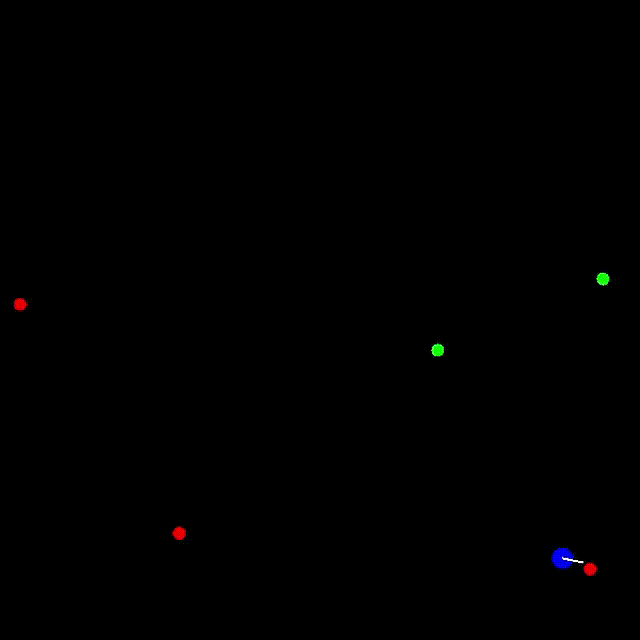

# Dubins TSP DQN Agent

### Example

[//]: # (![]&#40;README_assets/inference_play.gif&#41;)

### Explanation 

This project involves training a reinforcement learning agent using Deep Q-Learning (DQN) to navigate 
a 2D environment and visit a set of spatially distributed target points, 
analogous to the **Traveling Salesman Problem (TSP)**.

The Agent is subject to airplane-like motion constraints.
The agent:

- Moves at a constant speed and cannot stop or reverse,
- Has a limited turning rate, resembling a Dubins vehicle (non-holonomic motion), 
- Observes distances and angles to the remaining targets,

### Reward Engineering:

The reward system is carefully designed to guide the agent toward smart, efficient behavior:

- ✅ Visit Targets: The agent earns a +5 reward each time it reaches an unvisited dot (target).

- 📉 Get Closer to Goals: It gets a small bonus for reducing the distance to the nearest unvisited target.

- 🚫 Stay in Bounds: Moving outside the allowed area triggers a -3 penalty.

- 🔄 Avoid Circling: Repeating too many left or right turns results in a -10 penalty to discourage spinning in place.

- ↩️ Minimize Turning: Turning (even moderately) has a small penalty to encourage straighter paths.

- 🎯 Angle Efficiency: A separate angle-based penalty helps align the agent toward targets more directly.

- 🏁 Finish Early: Completing the task (visiting all points) gives a +20 reward.

- ⌛ Penalize Time: Every step costs a small time penalty, pushing the agent to be faster.

